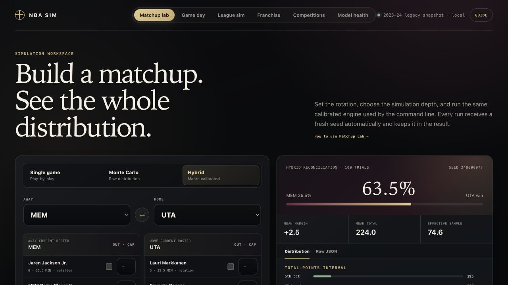

# NBA Sim

[](https://github.com/oorjitsethi/nba-sim/actions/workflows/tests.yml)
[](https://www.python.org/)

**[Launch the hosted Matchup Lab](https://nba-sim-three.vercel.app/)** — a
stateless, fictional-data demonstration of the same possession engine. The full
franchise game, Stats Central, league simulation, and persistent saves run locally.



> A full-fidelity NBA simulation and franchise-management game, built around
> possession-level basketball rather than spreadsheet score generation.

## What you can play

- **Quick Play:** run a single matchup with current rosters, availability,
  rotations, spatial shooting profiles, and a fresh replayable seed.
- **Franchise:** control any NBA team through an 82-game season, play-in,
  playoffs, offseason, contracts, free agency, trades, scouting, drafts,
  development, health, chemistry, coaching, awards, and long-term careers.
- **Stats Central:** browse sortable per-game or total statistics for your team,
  every NBA player, and all 30 teams; filter by season, team, regular season,
  play-in, or playoffs; and open complete player game logs.
- **Normal and Advanced interfaces:** Normal provides a guided game-style home,
  calendar, team, Stats, Trade Finder, free agency, and draft flow. Advanced
  exposes the underlying controls, diagnostics, model health, and research tools.

The interface choice never changes ratings or simulation accuracy. Both modes
use the same event-driven possession engine, team context, saved rotations,
health state, coaching environment, and deterministic league rules.

## Why it is different

Each scheduled matchup is simulated as one coherent game, possession by
possession. Player box scores are the direct result of those possessions—not
allocated afterward to fit a target score. Franchise state is event sourced and
replayable, while the forecasting layer is evaluated chronologically against
strong Elo and league-average baselines. Unproven research components remain
explicitly gated rather than silently promoted into forecasts.

NBA Sim is a research-oriented, hybrid basketball simulation engine. It combines
coherent possession and game generation with game-level probabilistic calibration,
while keeping every simulated outcome replayable and every random stream
reproducible.

This repository now contains a working vertical system, not just a collection of
model sketches:

- an event-sourced NBA rules engine with regulation, overtime, shot clocks, fouls,
  bonus free throws, rebounds, turnovers, substitutions, and foul-outs;
- a semi-Markov expected-possession-value model with competing terminal hazards;
- full box-score accounting and invariant checks;
- deterministic single-game, Monte Carlo, season, and playoff-series simulation;
- macro margin/total forecasts and minimum-KL reconciliation of coherent game
  samples;
- chronological Bayesian team-strength updates and regularized adjusted
  plus-minus;
- immutable, checksummed, bitemporal roster, injury, game, and market snapshots;
- official NBA roster, schedule, game-log, and injury-report ingestion;
- chronological multi-season backtesting against Elo and league-average baselines;
- licensed tracking archive validation and reproducible neural training manifests;
- explicit injury/out and minute-limit counterfactuals;
- leakage-safe, game-grouped tracking datasets;
- optional CourtMotion- and SportsNGEN-inspired PyTorch architectures.

## Research translation

The tracking subsystem combines two distinct research directions:

1. [CourtMotion](https://arxiv.org/abs/2512.01478) motivates directed skeletal
   graph encoding, shoulder-normal orientation, player-interaction attention,
   discretized trajectory prediction, and temporally projected event heads.
2. [SportsNGEN](https://arxiv.org/abs/2403.12977) motivates autoregressive
   player/ball object tokens, causal multi-agent attention, bounded offset
   classes, nucleus sampling, noisy inputs, and sport-specific stopping rules.

SportsNGEN did not establish an NBA result, and the checked-in neural architectures
do not contain trained weights. They become forecast models only after training on
licensed, time-aligned tracking data and passing held-out promotion gates.

## Quick start

Create the deterministic fictional demonstration database, then launch the game:

```bash
python -m venv .venv
.venv/bin/pip install -e . --no-build-isolation

.venv/bin/nba-sim-demo
.venv/bin/nba-sim-web
```

Open <http://127.0.0.1:8765>. For command-line experiments:

```bash
.venv/bin/nba-sim list-teams
.venv/bin/nba-sim simulate --home UTA --away MEM --seed 7
.venv/bin/nba-sim monte-carlo --home UTA --away MEM --trials 1000 --seed 7
.venv/bin/nba-sim hybrid --home UTA --away MEM --trials 1000 --seed 7
```

## Local dashboard

Launch the personal web interface:

```bash
.venv/bin/nba-sim-web
```

Then open <http://127.0.0.1:8765>. The dashboard includes single-game box
scores and event logs, Monte Carlo and hybrid distributions, player outs and
minute caps, round-robin seasons, playoff series, the league-fidelity audit, and
the rolling-origin historical backtest. The Game day workspace reads the latest
stored official schedule, shows whether the regular-season release is complete,
matches official injury rows to current player IDs, and runs availability-aware
forecast ensembles. Its 1,000-scenario default starts from the chronologically
fitted dynamic team-strength distribution, then applies current-roster deltas for
each sampled availability state.

League Sim generates the full NBA opponent-frequency structure: 1,230 games,
82 per team, exactly 41 home and 41 away, four division games per opponent, a
balanced three/four-game same-conference split, and two cross-conference games.
For every scheduled matchup it runs one complete possession-level game. The
pregame chronological forecast is retained as context, but the realized score is
not pulled back toward an ensemble average. Upsets and extreme nights therefore
survive as part of that seeded season. Player box scores come from the same native
play accounting as Matchup Lab rather than from a statistical allocator.
Same-day forecasts are frozen before that date's rating updates.

This full-fidelity path is intentionally compute-heavy. The dashboard runs it as
a cancellable background job and shows overall progress, the active matchup,
elapsed time, ETA, and seed. Reloading the page reconnects to an active job
as long as the local dashboard process is still running.
The local server binds to localhost by default. A public deployment should use
an isolated demo database and a host with durable storage; this repository does
not include user save data.

Matchup, season, and series submissions receive a fresh server-generated seed
automatically. Every result displays its seed so the same run can still be
reproduced through the API or command line.

The Franchise workspace begins the long-horizon rebuilding layer. It creates a
canonical 2026-27 league from the current roster profiles, stores it durably in
SQLite, autosaves calendar changes as hash-chained events, verifies every save by
deterministic replay, and can branch any loaded revision into an independent
timeline. Phase-one schemas cover franchises, players, staff, contracts, draft
assets, cap exceptions, injuries, and transactions; missing authoritative records
are left empty rather than fabricated. See
[`docs/FRANCHISE_KERNEL.md`](docs/FRANCHISE_KERNEL.md).

The rebuilding game now also includes a guided Contracts & Free Agency
workspace: complete explicitly modeled multi-year salary ledgers, five-season cap
planning, extensions, team/player options, waivers and dead money, exception-aware
free-agent negotiation, and autonomous CPU roster reviews. Every completed
decision is event sourced and replayable. Official 2026–27 system levels remain
separate from clearly labeled modeled salary estimates. See
[`docs/CONTRACTS_FREE_AGENCY.md`](docs/CONTRACTS_FREE_AGENCY.md).

Phase two adds a versioned 2026-27 CBA rules engine, the official salary-cap, tax,
apron, minimum-payroll, and mid-level-exception amounts, plus a guided transaction
checker for trade matching and apron hard-cap actions. A team cap sheet reports
contract coverage and refuses to treat unknown salaries as cap room.

Phase three adds durable player lifecycle records and a consumer-facing Player
Development workspace. Official season ages anchor nonlinear, attribute-specific
growth and decline when available; age remains unknown rather than inferred for
unmatched players. Workload, development focus, injury burden, retirement risk,
and correlated uncertainty are simulated across 400 seeded career paths. See
[`docs/PLAYER_LIFECYCLE.md`](docs/PLAYER_LIFECYCLE.md).

The century-continuity career phase turns those projections into permanent,
seeded offseason decisions. Retirement has no fixed age cutoff: ability, role,
contract demand, workload, health and team context condition an auditable draw.
Retired players leave active rosters without being deleted, retain box-score and
award history, and may make a rare two-year comeback attempt into free agency.
See [`docs/PERMANENT_PLAYER_CAREERS.md`](docs/PERMANENT_PLAYER_CAREERS.md).

Phase four adds persistent player health and workload state. Availability,
minute restrictions, acute and chronic external load, fatigue, recovery, and a
non-diagnostic load-concern index are event sourced with the Franchise timeline.
Every regular-season and playoff appearance also receives a separate seeded
injury-occurrence draw based on exposure, age, accumulated load, fatigue,
return-to-play state, and saved history. New injuries change future rotations,
record missed games, and automatically progress through a managed return ramp;
manual medical scenarios remain manual. Saved restrictions can directly
condition Matchup Lab rotations. See
[`docs/HEALTH_WORKLOAD.md`](docs/HEALTH_WORKLOAD.md).

Phase five adds persistent team chemistry and coaching strategy. Team sessions,
environment assessments, and coaching plans are event sourced; optional bounded
effects can condition Matchup Lab. See
[`docs/CHEMISTRY_COACHING.md`](docs/CHEMISTRY_COACHING.md).

Phase six adds a Scouting workspace with persistent uncertain player beliefs,
automatic weekly department cycles, manual prospect dossiers, evidence
provenance, and probabilistic archetypes. Established NBA players instead
receive exact normalized 25–99 OVRs, 37 detailed attributes, six spatial-zone
ratings, and hot/cold zones without scouting. See
[the established rating model](docs/ESTABLISHED_PLAYER_RATINGS.md) and
[the prospect scouting model](docs/SCOUTING_UNCERTAINTY.md).

Phase seven adds a persistent annual 75-player draft class, hidden latent talent,
Bayesian team scouting beliefs, automatic department allocation, verified
combine measurements, a private reorderable big board, pick ownership, the
16-team 3-2-1 lottery, and an event-sourced two-round draft room. Completed
drafts now materialize 60 players on modeled rookie-scale contracts plus 15
undrafted free agents; archived classes retain permanent draft provenance.
CPU front offices select from imperfect public information and cannot access the
user's private reports or hidden prospect truth. See
[`docs/DRAFT_ECOSYSTEM.md`](docs/DRAFT_ECOSYSTEM.md).

Phase eight adds an event-sourced Trade Center and the first public rebuilding-
game release. Trade Finder shops one asset or a six-asset package across all 29
teams, targets externally owned packages, ranks only legal accepted
constructions, and supports CPU counteroffers. The advanced machine routes every
player and pick explicitly through two-, three-, or four-team trades. Nonlinear
star scarcity, consolidation discounts, contract control, team-specific projected
pick slots, protections, roster fit, and organizational timelines prevent simple
quantity-for-quality exploits. Distinct front offices derive a competitive window, roster
needs, protected core, trade block, urgency, patience, and risk tolerance.
Salary matching, both aprons, Stepien, pick horizon, player waiting periods,
consent, reacquisition, roster limits, deadline enforcement, CPU acceptance,
and CPU-to-CPU trading remain independently configurable. See
[`docs/TRADING_ASSET_MARKET.md`](docs/TRADING_ASSET_MARKET.md) and the complete
[`franchise rebuild roadmap`](docs/FRANCHISE_REBUILD_ROADMAP.md).

The public rebuild's third release adds persistent league-wide Roster Operations.
The coach-medical optimizer creates five starters and exactly 240 minutes from
current ability, upside, coaching depth, readiness, workload, health and team
direction. Users can delegate decisions, approve staff recommendations, or edit
every role, minute target, designation and promise. Saved rotations directly
condition Matchup Lab and automatically reconcile after roster movement. See
[`docs/ROSTER_OPERATIONS.md`](docs/ROSTER_OPERATIONS.md).

The fourth release adds a persistent Season Hub: an NBA-balanced 1,230-game
calendar, one-click simulation of the entire remaining regular season, event-level
simulation using saved franchise rotations and health,
standings, native historical box scores, player leaderboards, the 7–10 play-in,
round-by-round best-of-seven playoffs, a navigable bracket and every postseason
box score. Its regular-season-only honors model produces MVP, DPOY, ROY, Sixth
Player, MIP, Clutch, Coach and Executive awards; five statistical titles;
All-NBA, All-Defense and All-Rookie teams; conference-finals MVPs; Finals MVP;
and sample-size-adjusted playoff risers and fallers. Postseason jobs report every
completed game while running, and every round survives deterministic replay.
See [`docs/FRANCHISE_SEASON_LOOP.md`](docs/FRANCHISE_SEASON_LOOP.md).

The fifth release adds persistent General Manager Intelligence for all 30 teams.
Front offices retain multi-year competitive directions, ownership spending and
patience, market context, job security, risk, priorities, protected cores, trade
blocks, roster needs, and explicit change triggers. Automatic reviews consume
record, recent form, strength, age, payroll, health, depth and draft capital;
the exact saved plan then drives Trade Finder values, negotiation behavior, core
premiums and CPU-to-CPU activity. See
[`docs/GENERAL_MANAGER_INTELLIGENCE.md`](docs/GENERAL_MANAGER_INTELLIGENCE.md).

The sixth release adds the public playtest experience: Guided, Balanced, and
Full Control onboarding; transparent Rookie, Pro, and Expert negotiation modes;
consequential-action confirmations; keyboard navigation; recovery guidance;
safety branches; and a copyable in-app readiness audit. Difficulty never changes
player ratings or possession simulation. The audit verifies the ledger, league,
rotations, schedule, box scores, contracts, CBA fixtures, and season plausibility.
First-time visitors also receive a ten-step guided Front Office School, remembered
by their browser and permanently replayable from the dashboard header.
See [`docs/PUBLIC_PLAYTEST_RELEASE.md`](docs/PUBLIC_PLAYTEST_RELEASE.md).

The ordered next-priority plan extends each save to a maximum of 100 fully
simulated seasons. It sequences deterministic offseason rollover, persistent
career progression and retirement, calibrated generated draft classes,
multi-season front-office economics, a resumable year-100 runner, complete league
history, and century-scale accuracy testing. See the
[`franchise rebuild roadmap`](docs/FRANCHISE_REBUILD_ROADMAP.md#next-priority-order--century-scale-league-continuity).

Priority one is now playable through the Season Hub: an eight-stage deterministic
offseason advances from awards and lottery through training camp, archives the
completed season, and opens the next balanced 1,230-game calendar. Repeated or
stale requests cannot apply a stage twice. See
[`docs/OFFSEASON_STATE_MACHINE.md`](docs/OFFSEASON_STATE_MACHINE.md). Priority
two is also playable: offseason progression now persists permanent careers,
retirement evidence, contract exits, game-derived career totals and rare
reinstatement attempts.

The multi-season economy foundation now advances the complete cap context with
the league year. Cap sheets, signings, maximum salaries, trade matching, apron
gates, ownership budgets and all 30 front-office reviews use the active season's
rules; future figures are visibly projected rather than presented as official.
The queued local coach/GM micro-model layer remains subordinate to these
deterministic validators. See
[`docs/MULTI_SEASON_LEAGUE_ECONOMY.md`](docs/MULTI_SEASON_LEAGUE_ECONOMY.md).

Lineup counterfactuals use NBA player IDs:

```bash
.venv/bin/nba-sim simulate \
  --home UTA --away MEM \
  --home-out 1628374 \
  --away-minute-limits 1628991:24 \
  --seed 7
```

Season and playoff modes:

```bash
.venv/bin/nba-sim season \
  --teams UTA,MEM,DEN,MIN --repeats 2 --seed 7

.venv/bin/nba-sim series \
  --higher-seed DEN --lower-seed MIN --best-of 7 --seed 7
```

Run the dependency-light verification suite and league-fidelity audit:

```bash
.venv/bin/python -m unittest discover -s tests -v
.venv/bin/nba-sim validate --games-per-matchup 5 --seed 2026
```

The optional tracking architecture requires PyTorch:

```bash
.venv/bin/pip install -e '.[tracking]' --no-build-isolation
```

## Point-in-time data and backtesting

Install the official-data adapters, then build the local append-only warehouse:

```bash
.venv/bin/pip install -e '.[data]' --no-build-isolation
.venv/bin/nba-sim-data sync-rosters --season 2026-27
.venv/bin/nba-sim-data sync-schedule --season 2026-27
.venv/bin/nba-sim-data sync-player-stats --season 2025-26
.venv/bin/nba-sim-data sync-games \
  --season 2022-23 --season 2023-24 \
  --season 2024-25 --season 2025-26
.venv/bin/nba-sim-data sync-injury \
  --season 2025-26 \
  --url 'https://ak-static.cms.nba.com/referee/injury/Injury-Report_2026-04-23_08_30PM.pdf'
.venv/bin/nba-sim-data inventory
.venv/bin/nba-sim-data backtest \
  --evaluation-start 2025-10-21 \
  --evaluation-end 2026-04-12 \
  --bootstrap-samples 5000 --seed 2026
```

Raw payloads, checksums, source availability timestamps, and normalized
observations are retained separately. Local data is ignored by Git. Market and
tracking importers accept licensed exports rather than scraping providers; see
[the data pipeline](docs/DATA_PIPELINE.md) for their contracts.

The local dashboard overlays official 2026-27 membership with completed 2025-26
base, advanced, and bio statistics. `STAT` marks an official prior-season
profile; `PRIOR` marks a player without a prior-season observation. The modeled
ten-player rotation is normalized to 240 minutes while the remaining current
roster stays available for injury scenarios.

As of July 25, 2026, the official 2026-27 feed contains 17 identified preseason
games and one team-TBD NBA Cup championship placeholder, but no regular-season
slate. The dashboard labels that snapshot `preseason_only`; it does not infer or
fabricate unreleased games.

## Verification status

The fixed-seed 2023-24 league-stat audit currently simulates 75 games / 150
team-games and compares 12 per-team-game box-score statistics. It records 2.23%
mean absolute percentage error and 5.78% maximum error. That is an aggregate
simulation-fidelity result, not evidence of game-level forecasting skill.

With the operational 2026-27 roster overlay and 2025-26 statistical profiles,
the same fixed-seed protocol records 3.03% mean error and 7.15% maximum error.
Its comparison target remains the bundled 2023-24 league ecology, so this is a
stability check rather than a 2026-27 forecast validation.

The frozen rolling-origin candidate was tuned on 2024-25 and evaluated on all
1,230 regular-season games from 2025-26. It beat margin-aware Elo on log loss
(0.5955 versus 0.6023; paired-bootstrap 95% interval for the difference
[-0.0133, -0.0007]). Margin MAE was slightly better (11.369 versus 11.451), but
its interval crossed zero, so the strict promotion gate correctly remains closed.

The schedule-context challenger was fitted on 3,690 games from 2022-23 through
2024-25, then frozen for the 1,230-game 2025-26 holdout. It models home court,
rest differential, back-to-backs, four-day congestion, travel, time-zone changes,
and altitude. It recorded 11.4490 margin MAE versus 11.4436 for the venue-only
baseline, while log loss improved slightly from 0.602063 to 0.601740. Neither
paired-bootstrap interval cleared zero, so learned schedule effects are visible
in the dashboard but automatically withheld. Neutral-site removal of the deployed
1.5-point home advantage remains active as a structural correction.

See [the architecture](docs/ARCHITECTURE.md),
[validation protocol](docs/VALIDATION.md), and
[model card](docs/MODEL_CARD.md) for exact boundaries.

## Package layout

```text
src/nba_sim/
  competition/  schedules, seasons, and playoff series
  data/         legacy adapter and point-in-time snapshots
  domain/       profiles, scenarios, rules, events, and game state
  epv/          semi-Markov possession hazards and expected value
  forecast/     distributions, ratings, macro priors, reconciliation
  simulation/   possession, game, rotation, statistics, Monte Carlo
  spatial/      multi-agent state, datasets, sampling, neural models
  validation/   fidelity gates and probabilistic scoring
  web_assets/   local dashboard interface
tests/          replay, invariant, determinism, and statistical tests
```

## Data and repository hygiene

No downloaded NBA database, model weights, or local franchise saves are committed.
The public repository builds a deterministic fictional fixture for tests and the
hosted demo. Downloaded source payloads, generated warehouses, franchise saves,
caches, model artifacts, and environment files are excluded from Git. Do not
commit licensed tracking exports or local save databases.

NBA Sim is an independent research project and is not affiliated with, endorsed
by, or licensed by the NBA, NBA 2K, Take-Two Interactive, or any NBA team.

## Stats semantics

Stats Central reads completed box scores already stored in a franchise; it never
resimulates games. A player appearance requires positive minutes. Traded-player
`TOT` rows combine all stints, team filters show only the selected stint, and
shooting percentages use total makes divided by total attempts. Regular-season,
play-in, and playoff statistics remain separate, and archived seasons remain
selectable.

## Testing

Run the complete suite before publishing:

```bash
.venv/bin/python -m unittest discover -s tests
```

For changes to the dashboard, also launch it and verify Quick Play, Franchise,
Stats, and Normal/Advanced switching in a browser.
