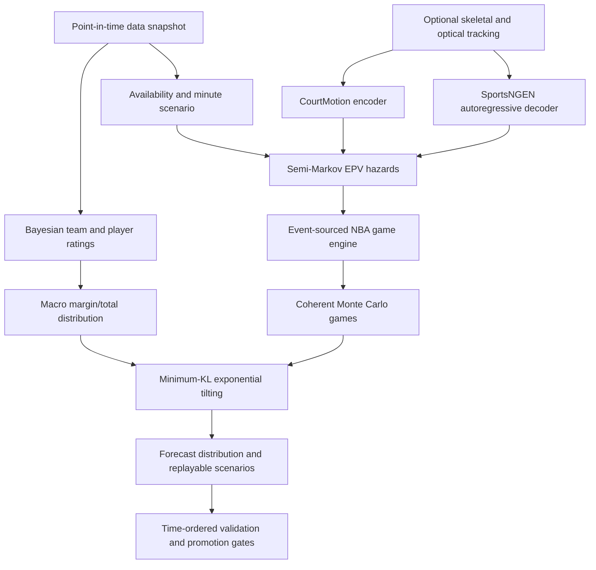

# Architecture

## Design objective

The simulator separates three questions that are often incorrectly collapsed:

1. What macro distribution best predicts the final margin and total?
2. What sequence of basketball events can coherently produce one sampled result?
3. What player and ball motion can coherently produce each possession?

This separation lets a strong top-down forecast constrain a detailed bottom-up
rollout without fabricating event or box-score combinations.

## Data plane

`RawSnapshotStore` writes immutable JSON or binary payloads plus SHA-256 manifests
atomically. `PointInTimeWarehouse` stores source availability separately from the
real-world event timestamp and resolves latest-known rosters, injuries, games,
and market quotes as of an explicit cutoff. Tracking training splits complete
games chronologically, so possessions and frames from one game cannot cross
train, validation, and test boundaries.

The included `LegacySQLiteRepository` is deliberately read-only. It translates
2023-24 player attributes and shot-zone tendencies into immutable profiles, applies
conservative efficiency shrinkage, and constructs a ten-player 240-minute
rotation.

## Spatial state and tracking

Every spatial frame represents all ten players and the ball jointly. Player state
contains court position, velocity, skeletal joints, and shoulder-derived facing
direction.

The optional neural implementation has two complementary paths:

- CourtMotion path: per-player skeletal graph message passing followed by temporal
  and multi-player attention, 11-by-11 trajectory classes, and nine
  past/current/future event heads.
- SportsNGEN path: player and ball object tokens, causal autoregressive attention,
  bounded coordinate-offset classes, rolling context, nucleus sampling, and
  injected ball-coordinate noise during data preparation.

If PyTorch or trained weights are unavailable, the same interface falls back to a
bounded kinematic rollout. The system never labels that fallback as a learned
tracking forecast.

`train-tracking` uses AdamW, gradient clipping, deterministic seeds, rare-event
weighting, and validation-selected checkpoints. Every checkpoint is accompanied
by a manifest containing the exact model/training configuration, chronological
split policy, corpus fingerprint, held-out loss, and checkpoint checksum.

## Possession and rules engine

The EPV model is a continuous-time competing-risk model. At each possession state,
it calculates hazards for turnovers, common or intentional defensive fouls,
two-point attempts, three-point attempts, and period expiration. Holding time is
sampled and bounded by both game and shot clocks.

Terminal actions enter an append-only event log. A deterministic reducer owns the
authoritative game state. Scores and box scores are derived from the event stream,
which makes replay equality a tested invariant.

The rules layer covers regulation and overtime lengths, new-possession and
offensive-rebound shot clocks, team-foul penalty logic, free throws, live missed
free throws, possession changes, substitutions, and foul-outs. Late-game score,
clock, pace, and intentional-foul context modify hazards directly.

## Forecast reconciliation

The event engine produces a discrete empirical distribution of coherent games.
The macro model supplies a target distribution over home margin and total.
`MomentReconciler` exponentially tilts the weights of complete simulated games to
match target first and second moments while minimizing KL divergence from the
original ensemble. Events are never edited after simulation.

Scheduled-game forecasts use the strongest operational macro path directly:
the dynamic team-strength model is updated chronologically through every stored
result, official injury statuses generate availability states, and a transparent
current-roster profile model supplies only the delta between the full and
conditioned roster. A schedule-context model can add rest/travel effects only
after its frozen-season paired-bootstrap gate passes. The response retains the
dynamic base, roster delta, schedule delta, context inputs, gate result, and seed.

The full League Sim uses the same possession engine as Matchup Lab. Its schedule
generator enforces the NBA's 82-game opponent-frequency and 41/41 home-away
invariants. Each scheduled matchup is one complete event simulation so a seeded
season keeps natural game-level variance rather than selecting toward an ensemble
mean. The chronological dynamic forecast is stored as pregame context. All games
on one date are forecast before any same-day result updates the ratings. Box
scores are built from the native event log and remain available by game ID without
sending all player rows in the initial season response.

League seasons run in a local background thread. The HTTP job API exposes
preparation, running, cancelling, completed, cancelled, and failed states plus
the current game, elapsed time, and ETA. The browser retains the active
job ID so a page reload can reconnect without restarting the simulation.

## Franchise state

Long-horizon franchise state is isolated from forecast inputs in an event-sourced
kernel. A typed `LeagueState` is stored as an immutable genesis snapshot; dated
events produce each later revision. SQLite persists save metadata and append-only
event streams. SHA-256 previous/head hashes make ordering and payload tampering
detectable during replay.

A branch starts from the fully replayed state and head revision of its parent,
then receives its own independent event stream. Current roster profiles populate
the initial franchises and players. Staff, contract, asset, exception, injury,
and transaction collections remain empty until authoritative data or a later
simulation phase registers them.

Player lifecycle records are part of the canonical state and reference roster
players by NBA player ID. New saves initialize the complete league; older saves
upgrade through one replayable event. The lifecycle projector is a pure,
seeded scenario function, so browsing a career range does not mutate league
state. Committed annual progression will use separate dated events in a later
phase.

Player health records provide complete player-linked coverage in new saves.
Health initialization, availability changes, and workload sessions are distinct
events. Calendar advancement deterministically decays acute load, chronic load,
and fatigue without auto-clearing a medical status. Matchup construction can
load one Franchise save and merge its inactive players and minute restrictions
with explicit game-day inputs.

Scouting records form a separate information layer for draft prospects only.
Established NBA players receive exact current game ratings. Every prospect
report persists posterior means and uncertainty for player skills and
potential, evidence volume, freshness, and probabilistic archetype.
Manual reports and automatic weekly department cycles are immutable events.
Calendar advancement triggers a due automatic cycle when a draft class exists.
Draft decisions consume prospect beliefs; established-player transactions consume
visible normalized current ratings.

The draft class is a separate aggregate inside `LeagueState`. Its private latent
player state is serialized in the local event ledger, while the dashboard
response is a deliberate information boundary that exposes only team beliefs.
The 2027 lottery samples all 16 positions using the 3-2-1 ball allocation and
enforces the bottom-three pick-12 floor. Draft slots preserve original and
current ownership, and all 60 selections replay deterministically.

Trade settings are another optional state aggregate so older save hashes remain
compatible. Initialization adds a complete seven-draft asset horizon without
overwriting imported ownership. Trade evaluation is pure and returns ownership,
rule, salary, apron, roster, timing, value, and acceptance results. Execution is
an atomic `trade_completed` event that changes player, active-contract, injury,
and pick ownership together. CPU market randomness is namespaced by league,
date, and revision and excludes the user-controlled team.

The franchise CBA module is versioned by salary-cap year. It computes payroll
bands and headroom, encodes the 2026-27 system levels, evaluates selected traded
player exceptions and mid-level exceptions, and applies the first- and
second-apron transaction table. Cap-sheet responses are explicitly incomplete
until every active player has an authoritative current-year salary.

## Reproducibility

All random draws derive from stable BLAKE2 namespaced seeds. A game ID, trial
number, or possession namespace receives the same random stream regardless of
iteration order or worker count. Multi-process execution falls back to serial
execution if the host forbids process semaphores.
